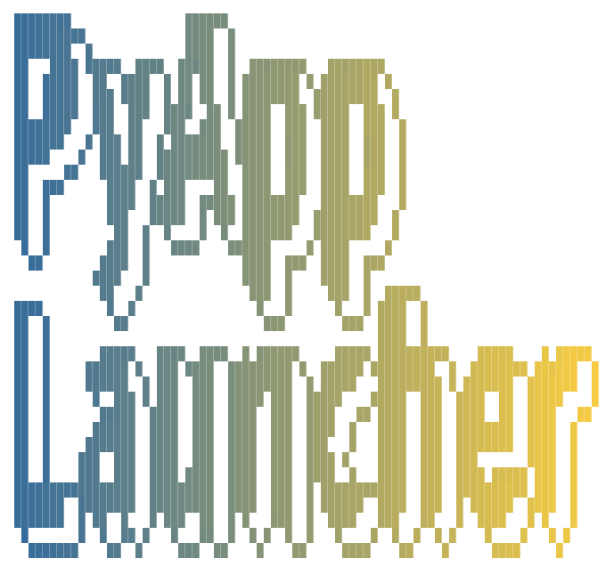

# Python App Launcher

<p align="center">
  
</p>

## 目次 / INDEX
- [日本語](#日本語)
- [English](#english)

---
## 日本語

### 概要
Pythonアプリケーションやボットを一括管理・監視するための、モダンで高性能なGUIランチャーです。CustomTkinterを採用し、洗練されたダークテーマのユーザーインターフェースを提供します。

### 主な機能
- **全GPU監視**: CPU、RAMに加え、NVIDIA、Intel、AMD（オンボード含む）のすべてのGPUをリアルタイムで監視。
- **グループ管理**: アプリを自由にグループ化。アイコン設定やサイドバーのスクロールにも対応。
- **Venvアシスト**: ボタン一つで仮想環境の構築やライブラリの更新が可能。
- **プロセス管理**: インラインでのログ監視、異常終了時の自動再起動、スケジュール起動をサポート。
- **多言語対応**: 日本語と英語をフルサポート。設定画面から即座に切り替え可能。
- **開発者ツール**: .envエディタ、メモ機能、フォルダ・ターミナルを直接開く機能を搭載。
- **システムトレイ**: アプリをトレイに格納し、バックグラウンドでの安定した稼働をサポート。

### 使い方

#### 事前準備
- Python 3.10以降
- Pip (Python パッケージマネージャー)

#### インストール
1. Windows:
   ```powershell
   python installer_win.py
   ```
2. macOS:
   ```bash
   python installer_mac.py
   ```

#### 実行
```bash
# Windows
.\.venv\Scripts\python.exe main.py

# macOS / Linux
./.venv/bin/python main.py
```

### 配布用ビルド
環境に依存しない単一の実行ファイルを生成します。
```bash
python build_app.py
```
- Windows: `dist/PythonAppLauncher.exe` を生成
- macOS: `dist/PythonAppLauncher.app` を生成

### ライセンス
このプロジェクトは [MIT License](LICENSE.md) のもとで公開されています。サードパーティ製ライブラリのライセンスについては同ファイル内を確認してください。

---
## English

### Description
A modern, high-performance GUI launcher for managing and monitoring multiple Python applications and bots. Built with CustomTkinter for a sleek, dark-themed experience.

### Key Features
- **Universal Monitoring**: Real-time tracking of CPU, RAM, and all GPUs (NVIDIA, Intel, AMD).
- **Smart Grouping**: Organize your apps into custom groups with specialized icons and scrollable sidebar.
- **Venv Support**: One-click virtual environment setup and library updates.
- **Process Management**: Real-time log terminal, auto-restart, and scheduled execution.
- **Global Ready**: Fully localized in English and Japanese with instant UI refresh.
- **Developer Tools**: Built-in .env editor, project memos, and terminal integration.
- **System Tray**: Minimize to tray to keep your workspace clean and applications running.

### Getting Started

#### Prerequisites
- Python 3.10 or later
- Pip (Python Package Manager)

#### Installation
1. Windows:
   ```powershell
   python installer_win.py
   ```
2. macOS:
   ```bash
   python installer_mac.py
   ```

#### Execution
```bash
# Windows
.\.venv\Scripts\python.exe main.py

# macOS / Linux
./.venv/bin/python main.py
```

### Building for Distribution
Create a single standalone executable file for your OS.
```bash
python build_app.py
```
- Windows: Generates `dist/PythonAppLauncher.exe`
- macOS: Generates `dist/PythonAppLauncher.app`

### License
This project is licensed under the [MIT License](LICENSE.md). Third-party library licenses are listed in the same file.


